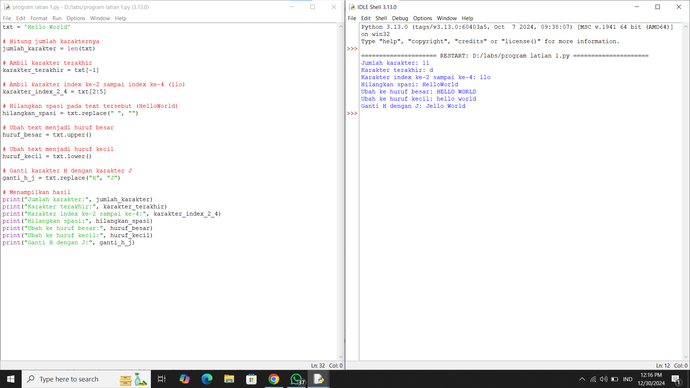
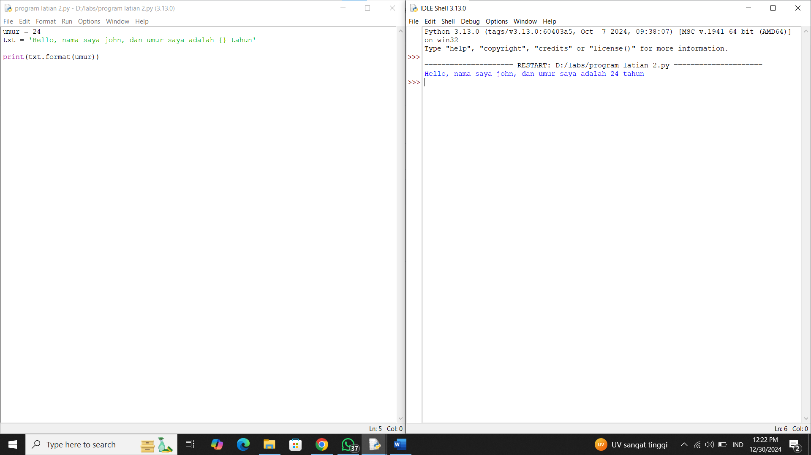
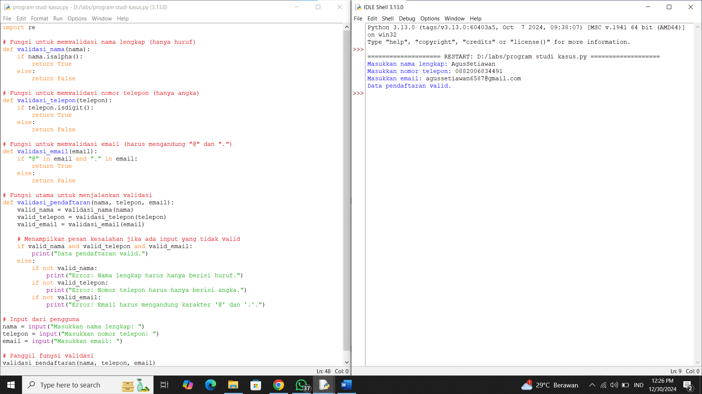

# Penjelasan Latian 1
1. len(txt): Fungsi len() digunakan untuk menghitung jumlah karakter dalam string txt. Pada kasus ini, string txt adalah 'Hello World', yang memiliki 11 karakter (termasuk spasi), sehingga hasilnya adalah 11.
2. txt[-1]: Indeks negatif dalam Python digunakan untuk mengakses elemen dari belakang string. Indeks -1 merujuk pada karakter terakhir dari string. Dalam contoh ini, karakter terakhir dari 'Hello World' adalah 'd', jadi hasilnya adalah 'd'.
3. txt[2:5]: Ini adalah operasi slicing yang digunakan untuk mengambil subset string dari txt. Indeks 2:5 berarti memulai dari indeks ke-2 (termasuk) hingga indeks ke-5 (tidak termasuk). Oleh karena itu, karakter pada indeks 2, 3, dan 4 adalah 'l', 'l', dan 'o', yang bersama-sama membentuk 'llo'.
4. txt.replace(" ", ""): Fungsi replace() digunakan untuk mengganti semua kemunculan substring pertama (spasi dalam hal ini) dengan substring kedua (string kosong ""). Dalam hal ini, spasi pada string 'Hello World' akan dihapus, menghasilkan 'HelloWorld'.
5. txt.upper(): Metode upper() mengubah semua huruf dalam string menjadi huruf besar. Hasil dari 'Hello World' menjadi 'HELLO WORLD'.
6. txt.lower(): Metode lower() mengubah semua huruf dalam string menjadi huruf kecil. Hasil dari 'Hello World' menjadi 'hello world'.
7. txt.replace("H", "J"): Fungsi replace() juga dapat digunakan untuk mengganti karakter tertentu dalam string. Dalam hal ini, karakter 'H' digantikan dengan 'J', sehingga hasilnya menjadi 'Jello World'.
8. print(): Di bagian akhir program, hasil dari berbagai operasi string dicetak menggunakan fungsi print(). Masing-masing perintah ini akan menampilkan hasil dari operasi sebelumnya.
# Screenshot Latian 1

# Penjelasan Latian 2
1. umur = 24: Variabel umur diisi dengan nilai 24.
2. txt = 'Hello, nama saya john, dan umur saya adalah {} tahun': String txt memiliki placeholder {} yang akan digantikan dengan nilai yang diberikan melalui metode format().
3. txt.format(umur): Metode format() digunakan untuk menyisipkan nilai umur ke dalam string pada posisi {}. Hasilnya adalah string yang lengkap dengan nilai umur yang telah dimasukkan.
# Screenshot Latian 2

# Penjelasan Studi Kasus
1. Fungsi validasi_nama:

    Fungsi ini bertugas untuk memvalidasi nama lengkap dengan memastikan bahwa string yang dimasukkan hanya berisi huruf.

    nama.isalpha(): Fungsi ini memeriksa apakah string nama hanya berisi huruf (tanpa angka atau karakter lainnya). Jika hanya berisi huruf, maka fungsi mengembalikan True, yang berarti valid. Jika tidak, maka akan mengembalikan False.
2. Fungsi validasi_telepon:

    Fungsi ini bertugas untuk memvalidasi nomor telepon dengan memastikan bahwa string yang dimasukkan hanya berisi angka.

    telepon.isdigit(): Fungsi ini memeriksa apakah string telepon hanya berisi angka (tidak ada karakter selain angka). Jika hanya berisi angka, maka fungsi mengembalikan True. Jika tidak, akan mengembalikan False
3. Fungsi validasi_email:

    Fungsi ini bertugas untuk memvalidasi email dengan memeriksa apakah email mengandung karakter @ dan . (tanda titik). Validasi ini cukup sederhana dan hanya memeriksa adanya dua karakter tersebut dalam string.

    "@" in email and "." in email: Jika kedua karakter tersebut ada dalam email, maka fungsi mengembalikan True, menandakan email valid. Jika salah satu atau keduanya tidak ada, maka fungsi mengembalikan False
4. Fungsi validasi_pendaftaran:

    Fungsi ini akan memanggil ketiga fungsi validasi yang telah dibuat sebelumnya dan memeriksa apakah semua input valid.

    Jika semua input valid (nama, telepon, dan email), maka fungsi ini akan mencetak "Data pendaftaran valid.".

    Jika salah satu input tidak valid, maka akan menampilkan pesan kesalahan yang sesuai untuk masing-masing input yang salah.
5. Input Pengguna:

    nama = input("Masukkan nama lengkap: "): Mengambil input nama dari pengguna.

    telepon = input("Masukkan nomor telepon: "): Mengambil input nomor telepon dari pengguna.

    email = input("Masukkan email: "): Mengambil input email dari pengguna.
6. Memanggil Fungsi Validasi:

    Fungsi validasi_pendaftaran dipanggil untuk memvalidasi input yang diberikan oleh pengguna. Fungsi ini akan memeriksa apakah nama, telepon, dan email valid sesuai dengan kriteria yang ditentukan.
# Screesnshot Studi Kasus

